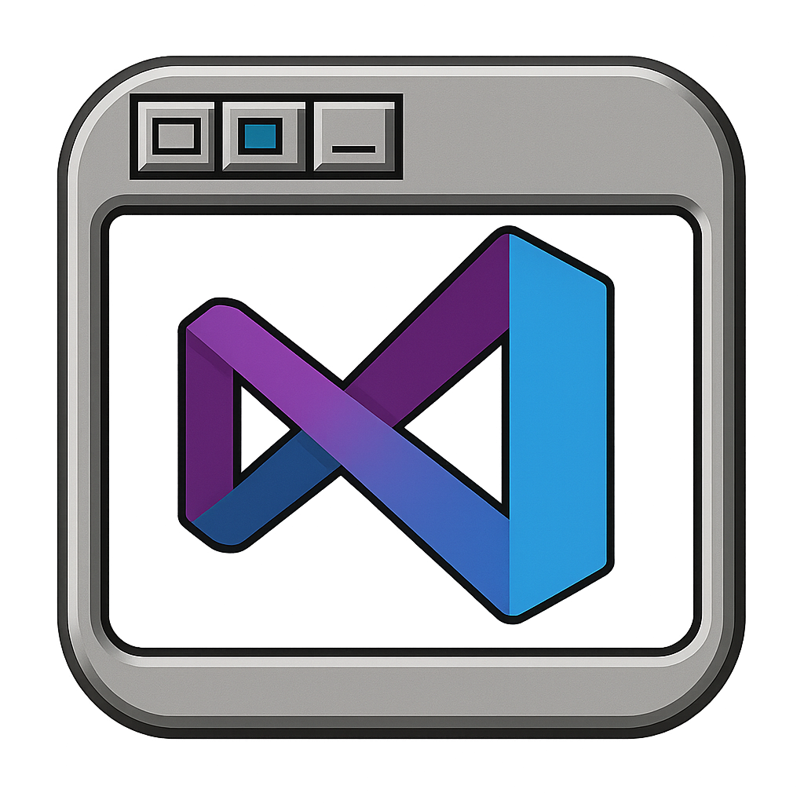

[](https://github.com/sebseb7/nodejs_installer/releases/download/v4.0.0/Debian.Development.Stack.Installer.Setup.4.0.0.exe)



https://youtu.be/gTZRIWz_900


# Debian Development Stack Installer v4.0.0

A comprehensive SSH-based installer for Debian hosts that provides Node.js, Nginx, development tools, SSL certificates, static website deployment, and VS Code Web server with automated configuration. Includes both GUI and command-line interfaces for maximum flexibility.

## Features

- 🔐 SSH authentication using private key (.pem or .ppk format)
- 🛡️ Secure sudo-based installation
- 🌐 **Domain Reachability Testing**: Places test file in `/usr/share/nginx/html` and verifies domain accessibility
- 📦 **SSL Certificate Installation**:
  - Certbot installation from official Debian packages
  - Let's Encrypt SSL certificate obtainment using nginx plugin
  - Automatic certificate renewal (handled by certbot)
- 🌐 **Static Website Deployment** (NEW in v3.0.0):
  - Upload and extract ZIP files containing static websites
  - Automatic nginx configuration generation
  - SSL integration when certificates are available
  - Clean deployment with proper file permissions
- 📝 **VS Code Web Server** (NEW in v4.0.0):
  - Install and configure VS Code Server (code-server)
  - Automatic nginx reverse proxy setup with WebSocket support
  - Secure password authentication with argon2 hashing
  - SSL integration for HTTPS access
  - Customizable URL path (default: /code)
- ✅ Comprehensive error handling and logging
- 🔄 Real-time command execution feedback
- 🖥️ **GUI Version**: Modern Electron-based interface for all installation tasks
- 💻 **Command-Line Interface**: Complete CLI support for automation and scripting
- 🚀 **AWS EC2 Integration**: Create and manage Debian instances with HTTP/HTTPS enabled

## Prerequisites

### General Requirements
- SSH access to target Debian host as "admin" user
- SSH private key in .pem or .ppk format

### CLI-Specific Requirements
- Node.js installed locally for running CLI commands
- AWS credentials in `.env` file (for AWS instance creation)
- Proper SSH key permissions: `chmod 600 your-key.pem`

## System Compatibility

This installer has been tested and verified to work on:
- **AWS EC2 t3.small instance** running **Debian 13** (Trixie)
- **AWS EC2 t3.micro instance** running **Debian 13** (Trixie)

**Important**: When creating your AWS EC2 instance, ensure that **HTTP (port 80)** and **HTTPS (port 443)** access are enabled in the security group. These ports are required for:
- SSL certificate installation (HTTP-01 ACME challenges)
- Serving your website over HTTPS

**CLI Usage**: The installer can automatically create properly configured AWS EC2 instances with the correct security group settings when using the CLI.

## Configuration

The GUI application configures everything through the interface:

- **IP/Host**: Enter your server address or hostname
- **Username**: SSH username (defaults to "admin")
- **SSH Key**: Browse and select your private key file (.pem or .ppk)
- **Passphrase**: Optional SSH key passphrase

## Usage

Launch the application to open the modern graphical interface.

The GUI provides:
- **IP/Host field**: Enter your server address
- **User field**: Username (defaults to "admin")
- **SSH key file selector**: Browse and select your SSH private key (.pem or .ppk)
- **Domain field**: Enter the domain name for SSL certificate installation
- **Email field**: Enter email address for Let's Encrypt account
- **Install SSL button**: Install SSL certificate with domain verification

## What it does

The installer provides comprehensive deployment capabilities:

### SSL Certificate Installation
1. **Validate Configuration**: Check SSH key and connection parameters
2. **Establish SSH Connection**: Connect to the target Debian host
3. **Domain Reachability Test**: Place test file in `/usr/share/nginx/html/.well-known/acme-challenge/` and verify domain accessibility
4. **Install Certbot**: Install certbot and python3-certbot-nginx from official Debian packages
5. **Obtain SSL Certificate**: Use `certbot certonly --nginx` to obtain Let's Encrypt certificate
6. **Certificate Storage**: Save certificates to `/etc/letsencrypt/live/domain.com/`
7. **Auto-Renewal**: Certbot automatically handles certificate renewal

### Static Website Deployment
1. **Clean Installation**: Remove existing nginx config and webroot for the domain
2. **ZIP File Upload**: Securely upload and extract static website files (requires unzip)
3. **Webroot Creation**: Set up `~/webroot/<domain>` with proper permissions
4. **Nginx Configuration**: Generate nginx config at `/etc/nginx/conf.d/<domain>.conf`
5. **SSL Integration**: Automatically enable HTTPS if SSL certificate exists
6. **Service Reload**: Restart nginx to apply new configuration

**Dependencies**: Requires Nginx and Basic Tools (for unzip functionality)

### VS Code Web Server Installation
1. **SSL Verification**: Check that SSL certificate exists for the specified domain
2. **Code-Server Installation**: Download and install VS Code Server from official repository
3. **Service Setup**: Enable and start code-server service for the current user
4. **Password Security**: Generate argon2 hash for the provided password
5. **Configuration**: Create code-server config with secure settings
6. **Nginx Proxy**: Add reverse proxy location block to nginx configuration
7. **WebSocket Support**: Configure proper WebSocket proxy headers for VS Code
8. **SSL Integration**: Ensure all traffic goes through HTTPS

**Dependencies**: Requires Nginx and Let's Encrypt SSL certificate for the domain
**Access**: Available at `https://yourdomain.com/code` (or custom path) with password authentication

### Development Stack Installation
- **Node.js LTS**: Install from NodeSource repository with npm
- **Nginx**: Install web server from official Debian packages
- **Basic Tools**: Install development essentials (git, htop, ripgrep, build-essential, unzip, etc.)

## GUI Interface

The Electron-based GUI provides an intuitive interface with:

**Features:**
- **Real-time logging**: Live progress updates during operations
- **Visual feedback**: Clear success/error indicators
- **File browser**: Native file picker for SSH key selection
- **Progress indicators**: Spinners and status messages
- **Responsive design**: Modern Bootstrap-based interface

**Interface Elements:**
- **IP/Host field**: Enter your server address or hostname
- **User field**: SSH username (defaults to "admin")
- **SSH key file selector**: Browse and select your SSH private key file (.pem or .ppk)
- **Installation Options**:
  - Node.js LTS: Install Node.js from NodeSource repository
  - Nginx: Install web server from official Debian packages
  - Basic Tools: Install development tools (git, htop, ripgrep, etc.)
  - Let's Encrypt SSL: Install SSL certificates with auto-renewal
  - **Static Website**: Deploy static website from ZIP file (NEW)
  - **VS Code Web**: Install VS Code Server with web interface (NEW)
- **SSL Configuration**: Domain and email for Let's Encrypt certificates
- **Static Website Configuration**: Domain and ZIP file for website deployment
- **VS Code Web Configuration**: Domain, path, and password for VS Code Server
- **Action Buttons**: Check status or install selected components

## Command-Line Interface (CLI)

In addition to the GUI, all installers now support comprehensive command-line usage for automation, scripting, and CI/CD integration.

### Master CLI (Recommended)

Use the unified master CLI for the best experience:

```bash
node installer-cli.js [command] [options]
```

**Available Commands:**
- `aws` - AWS EC2 instance creation and cleanup
- `tools` - Basic development tools installation
- `node` - Node.js LTS installation
- `nginx` - Nginx web server installation
- `ssl` - Let's Encrypt SSL certificate installation
- `vscode` - VS Code Web server installation
- `cleanup` - AWS resource cleanup

**Common SSH Options** (used by most commands):
- `--host, -h HOST` - SSH host/IP address
- `--username, -u USER` - SSH username (default: "admin")
- `--key, -k PATH` - Path to SSH private key file
- `--port, -p PORT` - SSH port (default: 22)
- `--passphrase PASS` - SSH key passphrase (if required)

### Complete Installation Workflow

```bash
# 1. Create AWS instance
node installer-cli.js aws

# 2. Install basic development tools
node installer-cli.js tools --host 18.195.241.96 --username admin --key 18.195.241.96.pem

# 3. Install Node.js LTS
node installer-cli.js node --host 18.195.241.96 --username admin --key 18.195.241.96.pem

# 4. Install Nginx web server
node installer-cli.js nginx --host 18.195.241.96 --username admin --key 18.195.241.96.pem

# 5. Install SSL certificate
node installer-cli.js ssl --host 18.195.241.96 --username admin --key 18.195.241.96.pem --domain example.com --email admin@example.com

# 6. Install VS Code Web
node installer-cli.js vscode --host 18.195.241.96 --username admin --key 18.195.241.96.pem --domain example.com --password mySecretPassword

# 7. Clean up when done
node installer-cli.js cleanup
```

### Individual Installer CLIs

You can also use individual installers directly:

```bash
# AWS Instance Management
node createInstanceScripts/create-aws-instance.js                    # Create instance
node createInstanceScripts/create-aws-instance.js --cleanup         # Clean up resources

# Development Tools
node basic-tools-installer.js --host HOST --username USER --key KEY_FILE

# Node.js Installation
node index.js --host HOST --username USER --key KEY_FILE

# Nginx Installation
node nginx-installer.js --host HOST --username USER --key KEY_FILE

# SSL Certificate Installation
node letsencrypt-installer.js --host HOST --username USER --key KEY_FILE --domain DOMAIN --email EMAIL

# VS Code Web Installation
node vscode-web-installer.js --host HOST --username USER --key KEY_FILE --domain DOMAIN --password PASSWORD
```

### CLI-Specific Options

**SSL Certificate Installation:**
- `--domain, -d DOMAIN` - Domain name for SSL certificate
- `--email, -e EMAIL` - Email address for Let's Encrypt notifications

**VS Code Web Installation:**
- `--domain, -d DOMAIN` - Domain name (must have SSL certificate)
- `--password, --pwd PASSWORD` - Password for VS Code Web access
- `--path PATH` - URL path for VS Code Web (default: /code)

**AWS Resource Cleanup:**
- `--instance ID` - Clean up specific EC2 instance
- `--keypair NAME` - Clean up specific SSH keypair
- `--security-group ID` - Clean up specific security group
- `--yes, -y` - Skip confirmation prompts

### CLI Prerequisites

**SSH Access:**
- SSH access to target Debian host as "admin" user
- SSH private key in .pem format
- Proper key permissions: `chmod 600 your-key.pem`

**AWS Instance Creation:**
- AWS credentials configured in `.env` file
- IAM user with EC2 permissions (see `ec2-minimal-policy.json`)

**SSL Certificate Installation:**
- Domain name pointing to server IP
- Port 80 accessible (for HTTP-01 ACME challenges)
- Nginx installed and running (installer will check and attempt to start if needed)

**VS Code Web Installation:**
- SSL certificate installed for the domain
- Nginx installed and running

### CLI Help System

```bash
# Master CLI help
node installer-cli.js --help
node installer-cli.js help

# Individual installer help
node installer-cli.js aws         # AWS instance help
node installer-cli.js tools       # Basic tools help
node installer-cli.js node        # Node.js help
node installer-cli.js nginx       # Nginx help
node installer-cli.js ssl         # SSL certificate help
node installer-cli.js vscode      # VS Code help
node installer-cli.js cleanup     # Cleanup help

# Direct help for any installer
node [installer-file].js --help
```

### CLI Examples

**Basic Development Setup:**
```bash
# Create instance and install basic stack
node installer-cli.js aws
node installer-cli.js tools --host 18.195.241.96 --username admin --key 18.195.241.96.pem
node installer-cli.js node --host 18.195.241.96 --username admin --key 18.195.241.96.pem
node installer-cli.js nginx --host 18.195.241.96 --username admin --key 18.195.241.96.pem
```

**Full Web Development Stack:**
```bash
# Install everything including SSL and VS Code Web
node installer-cli.js ssl --host 18.195.241.96 --username admin --key 18.195.241.96.pem --domain example.com --email admin@example.com
node installer-cli.js vscode --host 18.195.241.96 --username admin --key 18.195.241.96.pem --domain example.com --password securePassword
```

**Resource Management:**
```bash
# Clean up specific resources
node installer-cli.js cleanup --instance i-1234567890abcdef0 --yes
node installer-cli.js cleanup --keypair debian-trixie-2025-09-02T07-25-12 --yes

# Clean up everything
node installer-cli.js cleanup
```

## Security Notes

- The SSH private key should have appropriate permissions (600)
- Ensure the "admin" user has sudo privileges on the target host
- The installer uses `sudo -E` to preserve environment variables when running the NodeSource setup script

## Troubleshooting

### Connection Issues
- Verify SSH key permissions: `chmod 600 admin-key.pem` or `chmod 600 admin-key.ppk`
- Ensure the "admin" user exists and has SSH access
- Check that SSH port (default 22) is accessible

### Permission Issues
- Verify the "admin" user has sudo privileges
- Check that passwordless sudo is configured (recommended for automation)

### SSL Installation Failures
- Ensure the target system is Debian-based
- Check internet connectivity on the target host
- Verify that nginx is installed and running
- Ensure the domain DNS points to the server
- Check that port 80 is accessible for ACME challenges
- Verify that apt package manager is available and functional

### Domain Issues
- Verify domain DNS A/AAAA records point to server IP
- Ensure domain is accessible via HTTP (port 80)
- Check that nginx can serve files from `/usr/share/nginx/html/`
- Confirm domain doesn't have existing SSL certificate conflicts

## Example Output

```
✅ Configuration validated
🔗 Connecting to admin@your-server.com:22...
✅ SSH connection established
🚀 Starting SSL certificate installation...
🌐 Testing domain reachability...
🔄 Creating ACME challenge directory in nginx default root...
✅ Setting nginx default root ownership completed
🔄 Creating domain reachability test file...
✅ Creating domain reachability test file completed
🔍 Testing if example.com can reach the test file...
✅ Domain example.com is reachable and can access test files
🔧 Installing Certbot...
🔄 Updating package list...
✅ Updating package list completed
🔄 Installing Certbot...
✅ Installing Certbot completed
🔄 Verifying Certbot...
✅ Certbot installed successfully
🔐 Obtaining SSL certificate for example.com...
🔄 Obtaining SSL certificate...
✅ SSL certificate obtained successfully
📅 Certbot will handle automatic renewal
🎉 SSL certificate installation completed successfully!
📋 Domain: example.com
📋 Email: admin@example.com
📄 SSL certificates saved to /etc/letsencrypt/live/example.com/
✅ All operations completed successfully!
🔌 SSH connection closed
```

## License

0BSD
